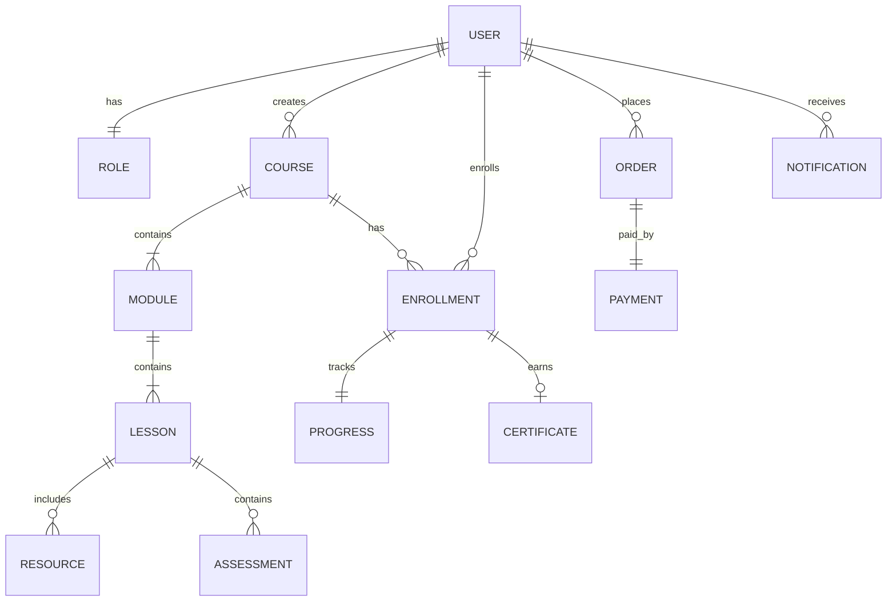

# 🧩 Domain Model

> Defines the core business entities, their responsibilities, relationships, and domain rules for Project Aurora.

---

---

# 📄 Document Information

| Property | Value |
|-----------|-------|
| Project | Project Aurora |
| Document | Domain Model |
| Document ID | AUR-DM-001 |
| Version | 0.1 |
| Status | Draft |
| Phase | Domain Modeling |
| Owner | Aurora Core Team |

---

# 🎯 Purpose

The Domain Model identifies the core business entities of Project Aurora and explains how they interact with each other.

This document serves as the foundation for:

- Database Design
- API Design
- Software Requirements Specification (SRS)
- High-Level Design (HLD)
- Backend Development
- Frontend Development

---

# 🌍 Domain Overview

Project Aurora is centered around digital learning.

The platform enables instructors to create and publish courses while allowing students to enroll, consume learning content, complete assessments, and earn certificates.

The domain is organized around the following major concepts:

- Users
- Courses
- Learning Content
- Enrollment
- Progress
- Assessment
- Certificates
- Commerce
- Notifications

---

# 🏛 Core Domain Entities

| Entity | Description |
|----------|-------------|
| User | Represents every registered platform user |
| Role | Defines user permissions |
| Course | Represents a learning program |
| Module | Logical section inside a course |
| Lesson | Individual learning unit |
| Resource | Files attached to lessons |
| Enrollment | Connects students with courses |
| Progress | Tracks learner completion |
| Assessment | Quiz or Assignment |
| Certificate | Course completion certificate |
| Order | Purchase information |
| Payment | Payment transaction |
| Notification | Platform communication |

---

# 📦 Entity Details

---

## 👤 User

### Purpose

Represents every registered user of Aurora.

### Responsibilities

- Authentication
- Profile Management
- Role Assignment

### Relationships

- Owns one Role
- Creates many Courses (Instructor)
- Enrolls in many Courses (Student)

---

## 🛡 Role

### Purpose

Defines access permissions.

### Examples

- Student
- Instructor
- Administrator

---

## 📚 Course

### Purpose

Represents a complete learning program.

### Responsibilities

- Store metadata
- Organize modules
- Publish content

### Relationships

- Created by Instructor
- Contains Modules
- Has Enrollments

---

## 📂 Module

### Purpose

Groups lessons within a course.

### Relationships

- Belongs to one Course
- Contains many Lessons

---

## 🎥 Lesson

### Purpose

Represents one learning session.

### Relationships

- Belongs to Module
- Contains Resources
- Has Assessments

---

## 📎 Resource

### Purpose

Represents learning material.

Examples:

- Video
- PDF
- ZIP
- External Link

---

## 🎓 Enrollment

### Purpose

Represents student participation.

Stores:

- Enrollment Date
- Status
- Completion

---

## 📈 Progress

### Purpose

Tracks learner activity.

Stores:

- Lessons Completed
- Percentage
- Last Accessed

---

## 📝 Assessment

### Purpose

Measures learner understanding.

Types:

- Quiz
- Assignment

---

## 🏆 Certificate

### Purpose

Issued after successful completion.

Stores:

- Issue Date
- Certificate Number
- Verification Status

---

## 💳 Order

### Purpose

Represents course purchase.

---

## 💰 Payment

### Purpose

Represents financial transaction.

---

## 🔔 Notification

### Purpose

Delivers platform messages.

Examples:

- Enrollment Success
- Course Published
- Certificate Generated

---

# 🔗 Entity Relationships

---

# 📜 Domain Rules

| ID | Rule |
|----|------|
| DR-001 | Every User must have one Role. |
| DR-002 | Every Course must have one Instructor. |
| DR-003 | Every Module belongs to one Course. |
| DR-004 | Every Lesson belongs to one Module. |
| DR-005 | Students must enroll before accessing course content. |
| DR-006 | Progress updates after lesson completion. |
| DR-007 | Certificates are generated only after all completion criteria are met. |
| DR-008 | Payments must succeed before access is granted to paid courses. |
| DR-009 | Notifications are generated for important platform events. |

---

# 🧭 Module Mapping

| Module | Domain Entities |
|----------|----------------|
| Identity | User, Role |
| Course | Course, Module, Lesson |
| Content | Resource |
| Learning | Enrollment, Progress |
| Assessment | Assessment |
| Certification | Certificate |
| Commerce | Order, Payment |
| Communication | Notification |

---

# 🚀 Future Domain Expansion

Future releases may introduce:

- Organization
- Department
- Team
- Live Session
- Discussion
- AI Tutor
- Subscription
- Mentor
- Batch
- Learning Path

---

# 📚 Revision History

| Version | Date | Description |
|----------|------|-------------|
| 0.1 | 27-Jul-2026 | Initial Domain Model |